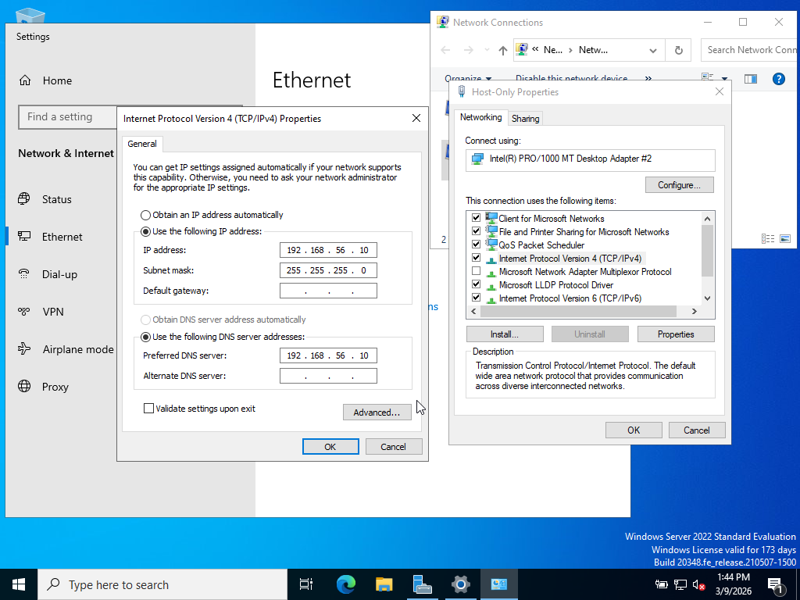
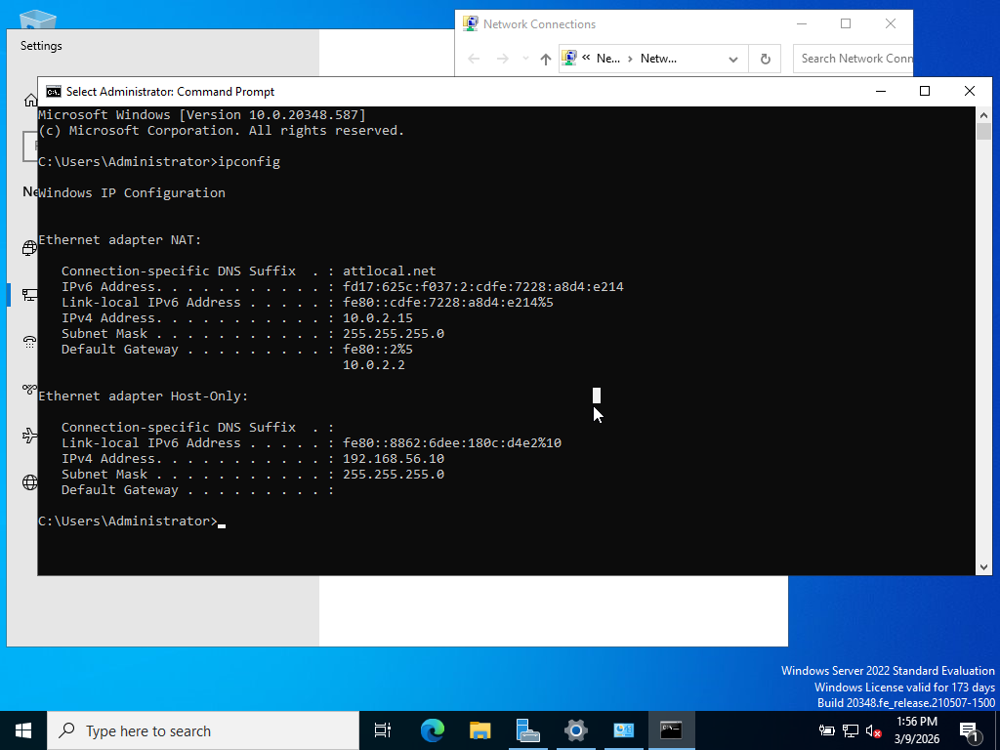
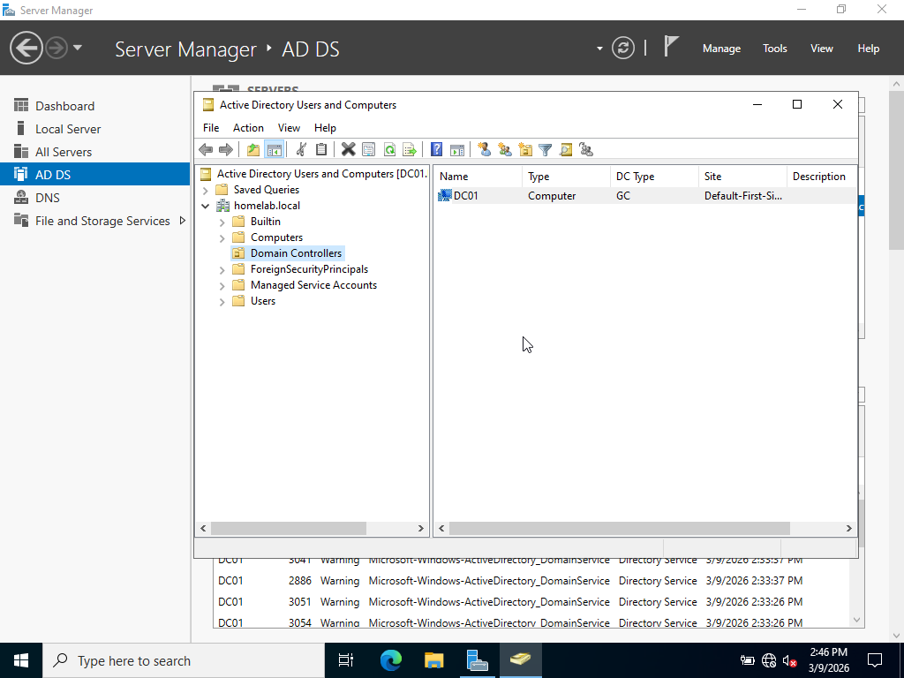

# Active Directory Domain Services Installation and Promotion to Domain Controller

## Goal
Successfully Install and configure Active Directory (AD) for domain "homelab.local" and promote DC01 to Domain Controller (DC)

### Steps    
- Set Administrator password during Windows Server Installation
- Set up IP Addressing: Settings -> Network & Internet -> Ethernet -> Change adapter options. Rename adapters to prevent future confusion (Ethernet -> NAT, Ethernet 2 -> Host-Only) 
- In Host-Only Properties, double click Internet Protocol Version 4 (TCP/IPv4) to enter IPv4 Properties tab. Then, set up custom IP address rather than an automatic one. IP address should be 192.168.56.x with a 255.255.255.0 subnet mask. Leave default gateway blank, and set Preferred DNS server to the same as the IP address.

- use ipconfig in command prompt to verify IP addresses have been updated  
    
- In Server Manager, select "Add roles and features" option
- Select DC01 in Server Selection
- Select Active Directory Domain Services as the role to install
- Confirm Installation
- Click "Promote this server to a domain controller" to open Deployment Configuration window
- Select "Add a new forest"
- Set a root domain name to "homelab.local"
- setup a DSRM password
- continue the rest of the setup with default options and Install (will Restart)
- After reboot, open Tools -> Active Directory Users and Computers. Then expand homelab.local and open the Domain Controllers folder to confirm that DC01 Computer is listed as the Domain Controller.

