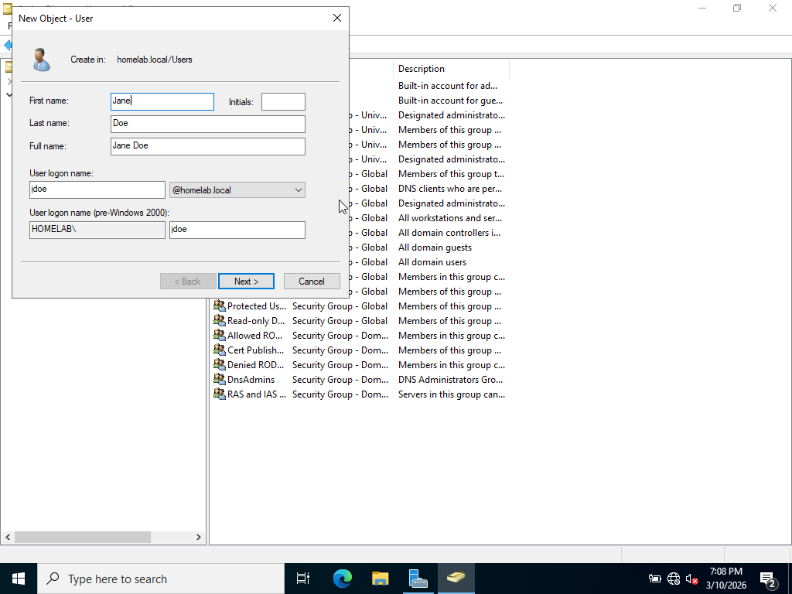
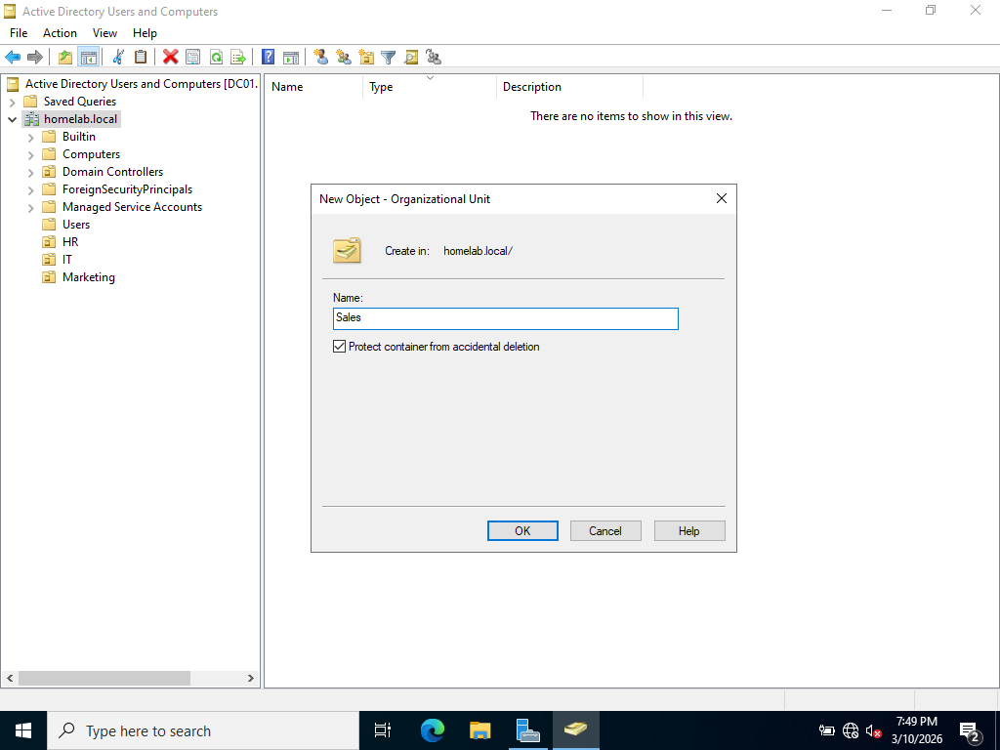
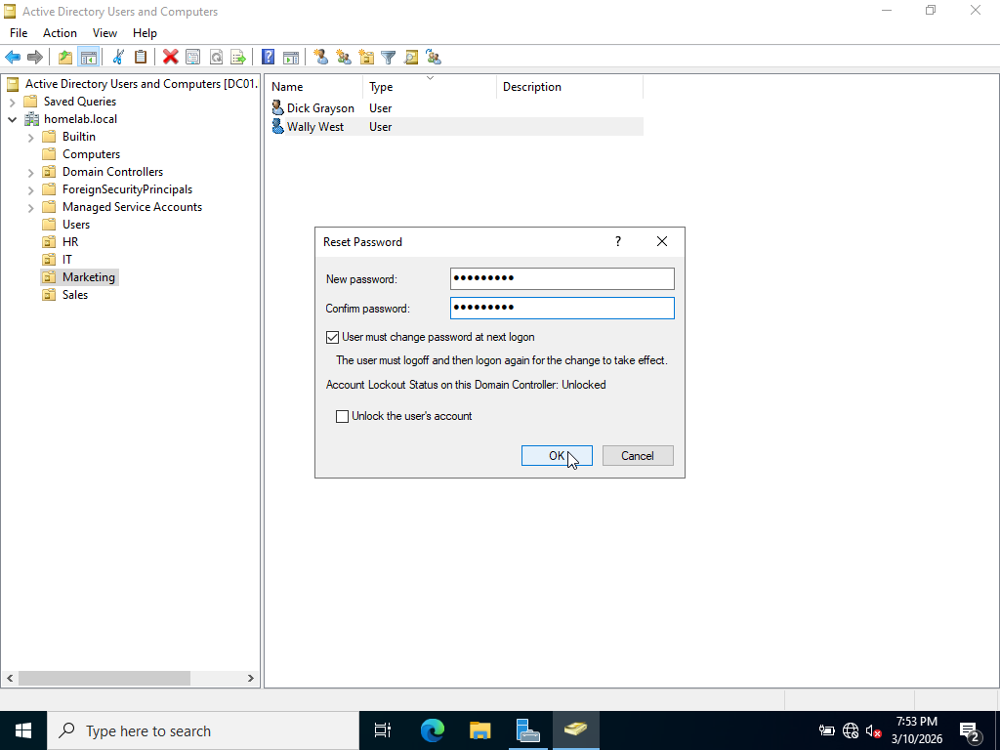

# Creation of Users and Organization Units in Active Directory

## Goal
Learn how to create Users and Organization Units (OUs) within the domain.

### Creating Users
- In Active Directory Users and Computers, right click Users container and select "New", then "User"
- Enter First and Last name, username, and password for new User and finish
- Verify new user appears in the Users container


### Creating Organizational Units
- Created Organizational Units for each department in a hypothetical organization, including HR, IT, Marketing, and Sales
- Done by right clicking the domain name (homelab.local), selecting New -> Organizational Unit, and naming it
- Additional Users were created and placed into each OU following same steps as above section


### Resetting Password
- Simulating the case of a user forgetting their password and requesting a password reset
- User Wally West requests password reset
- Navigate to Marketing OU and right click Wally West
- Click "Reset Password" and enter a new password
- Keep "User must change password at next logon" checked to ensure Wally West changes his password at next logon


### Single User Creation with Powershell
- Instead of using the GUI to create users, we will use Powershell commands to complete the job
- Use the "New-ADUser" cmdlet and fill in the basic User parameters as follows
```powershell
New-ADUser `
-Name "Peter Parker" `
-GivenName "Peter" `
-Surname "Parker" `
-SamAccountName "pparker" `
-UserPrincipalName "pparker@homelab.local" `
-Path "OU=Marketing,DC=homelab,DC=local" `
-AccountPassword (ConvertTo-SecureString "Password123" -AsPlainText -Force) `
-ChangePasswordAtLogon $true `
-Enabled $true
```
This creates a User named Peter Parker with username "pparker" in the Marketing OU. The password is set to the default "Password123" and a change of password is required at logon. This command effectively mimics the User creation process done earlier via the GUI in Active Directory Users and Computers. After running this command, running 
```powershell
Get-ADUser pparker
```
will verify that the new user was created and display user info. 

[SCREENSHOT]

### User Creation with a Reusable Script in Powershell
Using the Powershell Command above to create a user would be more practical if it was in a script to allow for reusability and efficiency. 
- Open Windows Powershell ISE to write, test, and run the script
- Here is the script (UserCreation.ps1)
```Powershell
param(
    [string]$FirstName,
    [string]$LastName,
    [string]$AccountName,
    [string]$OU,
    [string]$Domain = "homelab.local",
    [string]$Password = "Password123"
    )

Import-Module ActiveDirectory -ErrorAction Stop

$FirstHalfDomain = $Domain.Split('.')[0]
$SecondHalfDomain = $Domain.Split('.')[1]

New-ADUser `
-Name "$FirstName $LastName" `
-GivenName "$FirstName" `
-Surname "$LastName" `
-SamAccountName "$AccountName" `
-UserPrincipalName "$AccountName@$Domain" `
-Path "OU=$OU,DC=$FirstHalfDomain,DC=$SecondHalfDomain" `
-AccountPassword (ConvertTo-SecureString "$Password" -AsPlainText -Force) `
-ChangePasswordAtLogon $true `
-Enabled $true

$GroupName = "${OU}_Group"

Add-ADGroupMember -Identity $GroupName -Members $AccountName

#end of script ------------------------------
```

This script essentially runs the command to create a single user like before, but uses parameters to make it less time consuming. Previously, I needed to type out the entire command and hardcode the parameters on the CLI. Now, I can simple run the script on the CLI and type the few parameters needed. Additionally, it also places the new user in their respective security group using the "Add-ADGroupMember" command.
- Here is what is run on Powershell to create a user with the above script
```Powershell
.\CreateUser.ps1 -FirstName "Norman" -LastName "Osborne" -AccountName "nosborne" -OU "Sales"
```
-This creates a user "Norman Osborne" with username "nosborne" in the Sales department, and places them in the "Sales_Group" security group. 

[SCREENSHOT]


### Bulk User Creation in Powershell
The above two methods of creating a user work well for creating a single new user, but would be inefficient for bulk user creation. This problem can be solved by writing a Powershell script that creates a large number of users based on input from a CSV file. 
- The CSV file used is here:
```csv
FirstName,LastName,AccountName,OU
Tom,Brady,tbrady,HR
Aaron,Rodgers,arodgers,Sales
Tony,Romo,tromo,Sales
Justin,Herbert,jherbert,Marketing
Matthew,Stafford,mstafford,IT
Drake,Maye,dmaye,Sales
Jared,Goff,jgoff,HR
Joe,Burrow,jburrow,HR
Josh,Allen,jallen,IT
Lamar,Jackson,ljackson,Sales
```

- Here is the script (CreateUserBulk.ps1)
```powershell

param(
    [string]$CSVPath
    )

Import-Module ActiveDirectory -ErrorAction Stop

$Users = Import-Csv -Path $CSVPath

$Domain = "homelab.local"
$FirstHalfDomain = $Domain.Split('.')[0]
$SecondHalfDomain = $Domain.Split('.')[1]
$Password = "Password123"

foreach ($User in $Users) {
   
   New-ADUser `
   -Name "$($User.FirstName) $($User.LastName)" `
   -GivenName $User.FirstName `
   -Surname $User.LastName `
   -SamAccountName $User.AccountName `
   -UserPrincipalName "$($User.AccountName)@$Domain" `
   -Path "OU=$($User.OU),DC=$FirstHalfDomain,DC=$SecondHalfDomain" `
   -AccountPassword (ConvertTo-SecureString "$Password" -AsPlainText -Force) `
   -ChangePasswordAtLogon $true `
   -Enabled $true

   $GroupName = "$($User.OU)_Group"
   Add-ADGroupMember -Identity $GroupName -Members $User.AccountName

   Write-Host "Created User $($User.FirstName) $($User.LastName) in $($User.OU)"
    
}
   

#end of script ------------------------------
```

-This script uses a foreach loop to loop through each line of the provided CSV file and create users based on the data recieved. Each user is also put into their respective department security group. Here is the command run on PowerShell to create users contained in the CSV file "UsersToAdd.csv"
```powershell
.\CreateUserBulk.ps1 -CSVPath C:\DataFiles\CSV\UsersToAdd.csv
```

[SCREENSHOT]
[SCREENSHOT]
